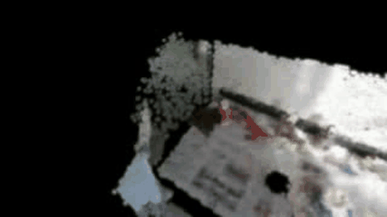

<div align="center">

# OneVideo2Policy

### One recorded manipulation sequence → metric scene → synthetic robot data → closed-loop policy

[](https://www.python.org/)
[](#reproduce-locally)
[](https://docs.astral.sh/ruff/)
[](LICENSE)
[](#scope-and-limitations)


<sub>Real project output: a 353-step Panda trajectory depth-composited into two registered views of the reconstructed HOI4D scene.</sub>

</div>

## What this project demonstrates

OneVideo2Policy is an independent, hardware-free reproduction study inspired by
**Video2Robo**. It tests whether geometry-aware synthetic data from one recorded
human manipulation sequence can train a small robot policy that survives controlled
appearance, pose, lighting, and camera shifts.

The selected experiment uses one **HOI4D RGB-D ball-to-bowl sequence**. RGB-D is
retained for metric scale and collision geometry; SAM2.1 Small, CoTracker3, TripoSR,
and Gaussian splatting provide the lightweight perception and appearance path. A
measured robosuite task supplies closed-loop evaluation without a physical robot.

### Main result

A selected checkpoint scored **97/100** across the original five-condition test, but
a stronger five-training-seed replication scored **76.0 ± 5.8%** under combined shift.
The system therefore demonstrates useful robustness from diverse synthetic data and
also reveals meaningful checkpoint sensitivity. The five-seed result misses the
frozen 80% stability target.

| Verified result | Measurement | Evidence |
|---|---:|---|
| SAM2.1 Small mask quality | source **0.777 IoU**, target **0.920 IoU** | [Perception audit](docs/perception-models.md) |
| CoTracker3 survival / identity | **0.914 / 0.951**, **0 swaps** | [Perception audit](docs/perception-models.md) |
| Rotation tracking ablation | **34.89 px → 0.70 px** median error | [JSON](docs/experiments/em1-0406-rotation-ablation.json) |
| Metric Gaussian scene | **7,007 Gaussians**, **+0.49 dB** held-out PSNR | [JSON](docs/experiments/hoi4d-gaussian-footprint-tuning.json) |
| Robot-scene registration | **2.7 mm** table-plane residual; **353 samples** | [JSON](docs/experiments/metric-registered-gaussian-demo.json) |
| Policy size and training | **2.61M parameters**, **4,000 frames**, **55.4 s** | [JSON](docs/experiments/ball-bowl-robustness-results.json) |
| Selected checkpoint | **97/100** across five conditions | [JSON](docs/experiments/ball-bowl-robustness-results.json) |
| Five-seed combined shift | **76.0 ± 5.8%**, 190/250 pooled | [JSON](docs/experiments/policy-replication-results.json) |
| Automated checks | **73 tests**, Ruff clean | [Tests](tests) |

## Pipeline


| Stage | Selected local component | Why it is used |
|---|---|---|
| Object masks | **SAM2.1 Hiera Small** | Smallest tested SAM2.1 variant that passed the independent mask gate |
| Point tracks | **CoTracker3** | Preserves orientation information that mask-only fitting loses |
| Visual mesh proposal | **TripoSR-128** | Watertight output with **1.87 GB** measured peak GPU allocation |
| Metric geometry | **HOI4D depth + fitted primitives** | Learned single-image meshes failed the 15% dimension gate |
| Scene appearance | **RGB-D initialized 3D Gaussian splats** | Lightweight view synthesis and controlled background variation |
| Robot task | **robosuite Panda ball-to-bowl** | Uses measured **38.321 mm** ball and **99.123 × 56.933 mm** bowl |
| Learned policy | **Dual-view visual waypoint network** | Compact 2.61M-parameter localization model with scripted task phases |
| Evaluation | **Paired closed-loop rollouts** | Holds episode seeds fixed across data and perturbation ablations |

The policy predicts task-relevant waypoints from two images. A deterministic controller
executes approach, grasp, transfer, place, and retreat. This isolates visual localization
from low-level control and keeps the experiment practical on a 6 GB GPU.

## Real generated outputs

<table>
<tr>
<td width="50%" align="center"></td>
<td width="50%" align="center"></td>
</tr>
<tr>
<td><b>Metric robot demonstration.</b> Two robosuite cameras registered to HOI4D task anchors. Robot pixels are depth-composited with the Gaussian scene; foreground visibility is 99.2–99.4%.</td>
<td><b>Recovered object motion.</b> The ball trajectory is replayed through a fused 7,007-Gaussian RGB-D scene. This output drives background and motion-conditioned data generation.</td>
</tr>
</table>

## Experiments

### 1. Synthetic data coverage matters


All rows use the same 50 paired combined-shift episodes. Counts are successes / episodes.

| Training coverage | Data size | Combined-shift result |
|---|---:|---:|
| One recorded demonstration | 1 trajectory | **3/50 (6%)** |
| Clean simulator frames | 500 | **1/50 (2%)** |
| Appearance + object pose | 2,000 | **10/50 (20%)** |
| + camera variation | 3,000 | **25/50 (50%)** |
| + combined perturbations | 4,000 | **41/50 (82%)** |
| Privileged oracle ceiling | — | **50/50 (100%)** |

The clean 500-frame model is worse than the one-demo fit on this shifted test. The gain
appears only as the training distribution gains pose, appearance, camera, and combined
coverage; sample count alone does not explain it.

### 2. The selected checkpoint is strong but seed-sensitive

| Test condition | Selected checkpoint |
|---|---:|
| Nominal | **20/20** |
| Camera shift (2 cm) | **19/20** |
| Half lighting | **20/20** |
| Gaussian background | **20/20** |
| All shifts combined | **18/20** |
| **Total** | **97/100** |

Five independent training seeds on a larger, fixed combined-shift test produced
**82%, 68%, 78%, 72%, and 80%** success. The mean is **76.0%**, the sample standard
deviation is **5.8 percentage points**, and the pooled count is **190/250**. This is
the primary reliability result; 97/100 describes one selected checkpoint.

### 3. Camera displacement is the clearest failure axis

| Camera displacement | 0 cm | 1 cm | 2 cm | 3 cm | 4 cm |
|---|---:|---:|---:|---:|---:|
| Success | **49/50** | **47/50** | **38/50** | **30/50** | **25/50** |
| Rate | 98% | 94% | 76% | 60% | 50% |

Performance falls monotonically beyond 1 cm, showing that viewpoint coverage remains
the largest measured weakness of the compact visual policy.

### 4. Tracked correspondences recover motion that masks miss

<table>
<tr>
<td width="50%"></td>
<td width="50%"></td>
</tr>
<tr>
<td>Across 13 frames and 82 held-out correspondences, tracked fitting cuts median error by <b>98.0%</b> and recovers a median <b>−41.7°</b> image-plane rotation.</td>
<td>Stable Fast 3D is proportionally closer than TripoSR, but neither learned mesh passes the 15% metric extent gate. RGB-D geometry is retained for physics.</td>
</tr>
</table>

| Reconstruction | Scale-aligned extents | Peak GPU | Watertight | Max secondary error |
|---|---:|---:|:---:|---:|
| RGB-D reference | 81.9 × 60.6 × 35.4 mm | — | — | — |
| TripoSR-128 | 81.9 × 69.7 × 14.5 mm | **1.87 GB** | Yes | 58.9% |
| Stable Fast 3D | 81.9 × 68.3 × 23.7 mm | **6.17 GB** | No | 33.1% |

## Reproduce locally

### Lightweight package and checks

```bash
git clone https://github.com/phongviet/OneVideo2Policy-From-one-human-video-to-robust-robot-manipulation-data.git
cd OneVideo2Policy-From-one-human-video-to-robust-robot-manipulation-data
uv sync --extra dev --extra video
uv run ov2p validate-config configs/place.yaml
uv run ruff check .
uv run pytest
```

### Prepare a video or RGB-D sequence

```bash
uv run ov2p prepare-video path/to/demo.mp4 \
  --output data/interim/demo --fps 30 --max-width 960
uv run ov2p validate-manifest data/interim/demo/manifest.json
```

For RGB-D input, add `--depth-dir path/to/depth`. The output manifest records original
frame IDs, timestamps, image paths, depth alignment, and both source and inference
resolutions.

### Run the CPU-safe end-to-end baseline

```bash
uv run ov2p run-local-e2e \
  --config configs/two_paths.yaml \
  --manifest data/interim/hoi4d_ball_to_bowl_gate/manifest.json \
  --masks data/interim/hoi4d_ball_to_bowl_gate/masks \
  --output results/local_e2e/hoi4d_ball_to_bowl
```

### Re-run the policy study

The full study needs robosuite, MuJoCo EGL, PyTorch, and the already generated local
training data. It runs 5 training seeds and 800 evaluation episodes:

```bash
MUJOCO_GL=egl PYTHONPATH=scripts .venv/bin/python scripts/run_report_experiments.py
```

Generated datasets, checkpoints, rollouts, and reports stay local and are ignored by
Git. Compact, reviewable measurements are committed under [`docs/experiments`](docs/experiments).

## Repository map

```text
configs/                 frozen task, model, metric, and gate settings
docs/assets/             real GIFs, figures, and diagrams used in this README
docs/experiments/        compact JSON records for reported measurements
scripts/                 data generation, model training, rendering, and evaluation
src/onevideo2policy/     reusable video, geometry, tracking, generation, and policy code
tests/                   fast CPU-only unit and integration tests
data/, results/, weights/ local inputs and generated artifacts (ignored)
reports/                 local paper sources and builds (ignored)
```

More detail: [two-path execution](docs/two-path-execution.md),
[Gaussian splatting](docs/gaussian-splatting.md),
[local model benchmarks](docs/local-model-benchmarks.md), and
[Video2Robo gap audit](docs/video2robo-gap-audit.md).

## Scope and limitations

- The evidence covers one rigid ball-to-bowl **Place** task in simulation.
- The selected metric path uses one RGB-D sequence, so the final system is not a
  strictly monocular reconstruction pipeline.
- Gaussian splats provide appearance; fitted metric primitives provide collision
  geometry because both learned mesh alternatives failed the dimension gate.
- The learned network estimates waypoints; grasp phase logic and low-level control are
  scripted.
- Camera variation remains a major failure mode, and five-seed performance is below the
  frozen 80% robustness target.
- Physical robot execution, sim-to-real success, deformable objects, bimanual control,
  and VLA training were not evaluated.

## Acknowledgements and license

This independent study is inspired by **Video2Robo** and is not affiliated with its
authors. SAM2, CoTracker3, TripoSR, Stable Fast 3D, HOI4D, robosuite, and MuJoCo are
external projects or datasets and are not vendored here. Follow their respective terms
when downloading models or data.

Released under the [MIT License](LICENSE).
