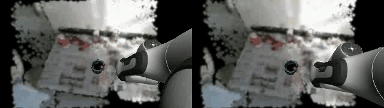
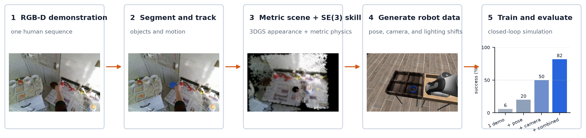
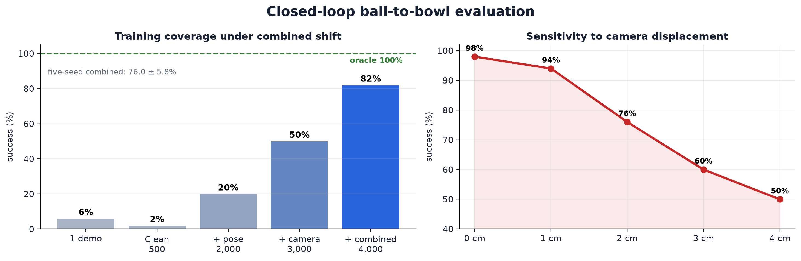
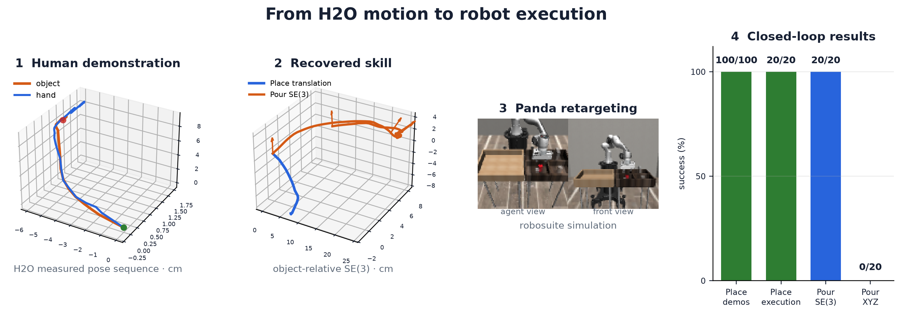
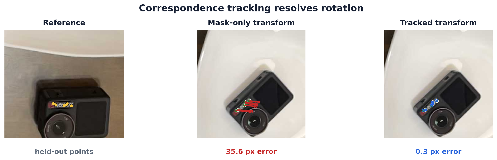

<div align="center">

# OneVideo2Policy

### From one human demonstration to robot training data with lightweight 3D perception, SE(3) skill transfer, and closed-loop evaluation

[](https://www.python.org/)
[](#reproduce-the-results)
[](https://docs.astral.sh/ruff/)
[](LICENSE)
[](#current-limitations)



<sub>Project output: a 353-step Panda trajectory depth-composited into two registered views of an HOI4D scene.</sub>

</div>

## Why this project?

A single demonstration contains one object layout, camera pose, lighting condition, and
motion trace. A robot policy trained on that observation alone has little reason to work
when any of them changes.

This project asks two concrete questions:

1. **Can one RGB-D demonstration generate enough controlled variation for a compact
   visual policy to remain robust in simulation?**
2. **When is XYZ motion sufficient, and when must the transferred skill preserve full
   SE(3) orientation?**

The main study uses an HOI4D ball-to-bowl sequence. H2O Place and Pour sequences test
SE(3) transfer, while four additional HOI4D actions expose where the current pipeline
stops. All robot executions reported here are in simulation.

## What this project shows

- **Resource-efficient data generation:** SAM2.1 Small, tracked correspondences, RGB-D
  geometry, Gaussian splats, and a 2.61M-parameter policy run on the local machine.
- **Synthetic coverage improves robustness:** combined-shift success rises from **6% to
  82%** as pose, appearance, camera, and joint perturbations are added. Across five
  training seeds, the result is **76.0 ± 5.8%**.
- **The action representation matters:** the H2O Pour orientation segment succeeds
  **20/20** with SE(3) and **0/20** with XYZ-only transfer. Rigid Place is supported;
  articulated lid and door actions remain outside the implemented skill model.

## Key results

| Finding | Measured result |
|---|---:|
| Synthetic coverage under combined shift | **6% → 82%** |
| Five-seed repeatability | **76.0 ± 5.8%**, 190/250 |
| H2O Place data and execution | **100/100** demos, **20/20** estimated-translation runs |
| H2O Pour orientation transfer | SE(3) **20/20**, XYZ **0/20** |
| Harder HOI4D actions | **0/4** strict end-to-end passes; articulated skills unsupported |

Machine-readable measurements are committed under
[`docs/experiments`](docs/experiments).

## Pipeline



One RGB-D sequence supplies object masks, correspondences, metric depth, and motion.
Gaussian splats represent appearance; depth-fitted primitives provide metric scale and
collisions. The recovered object-relative skill is retargeted to a Panda and rendered
under controlled pose, camera, lighting, and background shifts. A compact visual model
is then evaluated in closed loop.

The [detailed measured pipeline figure](docs/assets/project-overview.png) records the
models, intermediate artifacts, and stage-level measurements.

## Does synthetic coverage improve robustness?



Each coverage row uses the same 50 paired combined-shift episodes. The clean 500-frame
model performs worse than the one-demo fit, while systematic variation raises success
to **41/50**. More samples alone do not explain the improvement; their coverage does.
The privileged oracle reaches 50/50 and is shown as a ceiling rather than a learned
baseline.

| Training coverage | Frames | Combined-shift success |
|---|---:|---:|
| One recorded demonstration | 1 trajectory | **3/50 (6%)** |
| Clean simulator data | 500 | **1/50 (2%)** |
| Appearance + object pose | 2,000 | **10/50 (20%)** |
| + camera variation | 3,000 | **25/50 (50%)** |
| + combined perturbations | 4,000 | **41/50 (82%)** |

The selected checkpoint scores **97/100** across five nominal and shifted conditions.
Five independent seeds score **82%, 68%, 78%, 72%, and 80%**, giving the more reliable
estimate of **76.0 ± 5.8%**. Camera displacement is the clearest measured weakness:
success decreases from **98% at 0 cm** to **50% at 4 cm**.

## Does SE(3) matter for Place and Pour?



An H2O `place milk` interval provides a stable object-to-hand transform and an
object-relative trajectory. Retargeting produces **100/100** validated Panda
trajectories with 23,972 control samples. On paired held-out simulator starts, both the
oracle and the visual model's **estimated translation** produce **20/20** Place success.
Translation error is 4.62 mm mean and 7.39 mm p90.

This is not reliable full 6D pose estimation. Absolute yaw error is high because the can
proxy is rotationally symmetric and the top grasp does not constrain yaw, so Place uses
the estimated translation with the recovered skill orientation.

For `pour milk`, the evaluation transfers the first **41.14° orientation segment**. It
tests whether the robot reaches the demonstrated pose while retaining the grasp; it does
not simulate liquid or measure poured volume. Full SE(3) succeeds **20/20**, while the
same translation with fixed orientation succeeds **0/20**. See the
[full H2O protocol](docs/h2o-policy-and-pour.md).

## Where does the pipeline break on harder actions?

The current representation supports rigid Place and orientation-sensitive Pour
retargeting. It does not yet extract articulated joint state or generate matching robot
tasks for lids and doors.

| Action | Required representation | Current outcome |
|---|---|---|
| Mug Place | Rigid SE(3) | Metric motion passes; no separate placement target |
| Kettle Pour | Orientation-sensitive SE(3) | Supported by the H2O retargeting experiment |
| Trash-can lid | Articulated joint motion | Unsupported; part segmentation also fails |
| Storage door | Articulated joint motion | Unsupported; part mask recovers with negative prompts |


**Result: 0/4 strict end-to-end passes.** RGB-D odometry passes all four sequences, but
perception, metric motion, action semantics, task generation, or policy availability
blocks every row before a matching visual policy can be evaluated.

<details>
<summary>Stage-level measurements and links</summary>

Across 61 local sequences, each action contains 300 object-pose records and 300 motion
masks. The five-sequence audit covers rigid pick/place, pouring, and articulated
open/close motion.

- SAM2.1 Small reaches **0.946 mug IoU** and **0.971 kettle IoU**.
- A one-point prompt fails on the trash-can lid and storage door. Part-aware negatives
  recover the storage door to **0.802 IoU**; the trash-can lid remains at **0.212**.
- RGB-D odometry reaches **0.72–0.76 px** median reprojection error and **2.5–3.3 mm**
  median depth residual.
- The mug reaches metric motion, then fails because the sequence lacks a separately
  tracked placement target.

Protocols and data: [whole-pipeline study](docs/hoi4d-whole-pipeline-study.md),
[input audit](docs/hoi4d-cross-action-study.md), and
[machine-readable results](docs/experiments/hoi4d-whole-pipeline-results.json).

</details>

## Implementation evidence

### Tracked correspondences recover rotation that masks miss



Across 13 frames and 82 held-out correspondences, tracked fitting reduces median
image-plane error from **34.89 px to 0.70 px** and recovers a median **−41.7°** rotation.

### Why not use a learned mesh for physics?

TripoSR-128 and Stable Fast 3D were tested as local alternatives to larger
reconstruction models. After scale alignment, neither passes the 15% secondary-extent
gate: their maximum errors are **58.9%** and **33.1%**. The pipeline therefore uses
Gaussian splats for appearance and RGB-D-fitted primitives for metric collision
geometry. The full comparison is in the
[local model benchmark](docs/local-model-benchmarks.md) and
[metric reference record](docs/experiments/em1-0406-reconstruction-proportions.json).

### Lightweight configuration

| Component | Local choice | Role |
|---|---|---|
| Segmentation | SAM2.1 Small | Object masks |
| Motion | CoTracker3 + verified correspondences | Point tracks and rotation |
| Geometry | RGB-D fusion + fitted primitives | Metric scale and collisions |
| Appearance | 3D Gaussian splats | Scene rendering and variation |
| Policy | 2.61M-parameter dual-view model | Visual translation / waypoint estimate |
| Evaluation | robosuite + MuJoCo | Closed-loop simulated execution |

Repository layout and deeper implementation notes are under
[`docs`](docs), including [Gaussian splatting](docs/gaussian-splatting.md),
[two-path execution](docs/two-path-execution.md), and the
[Video2Robo gap audit](docs/video2robo-gap-audit.md).

## Current limitations

The ball-to-bowl learned policy is robust only within the measured synthetic shifts and
remains sensitive to camera displacement. H2O experiments validate retargeting in
robosuite; they do not use a physical robot. The Pour result evaluates an orientation
segment without liquid dynamics. The visual H2O model supplies accurate translation for
Place but does not provide reliable full 6D pose because yaw is ambiguous. Articulated
objects, part joints, and automatic task generation for lids and doors are unsupported.
All robot results in this repository are simulation results.

## Reproduce the results

<details>
<summary>Installation, validation, and experiment commands</summary>

### Install and run fast checks

```bash
git clone https://github.com/phongviet/OneVideo2Policy.git
cd OneVideo2Policy
uv sync --extra dev --extra video
uv run ov2p validate-config configs/place.yaml
uv run ruff check .
uv run pytest
```

### Prepare a video or RGB-D sequence

```bash
uv run ov2p prepare-video path/to/demo.mp4 \
  --output data/interim/demo --fps 30 --max-width 960
uv run ov2p validate-manifest data/interim/demo/manifest.json
```

For RGB-D input, add `--depth-dir path/to/depth`. The manifest records source frame IDs,
timestamps, image paths, depth alignment, and inference resolution.

### Run the CPU-safe baseline

```bash
uv run ov2p run-local-e2e \
  --config configs/two_paths.yaml \
  --manifest data/interim/hoi4d_ball_to_bowl_gate/manifest.json \
  --masks data/interim/hoi4d_ball_to_bowl_gate/masks \
  --output results/local_e2e/hoi4d_ball_to_bowl
```

### Re-run the simulation studies

The full policy study needs robosuite, MuJoCo EGL, PyTorch, and the generated local
training data. It runs five training seeds and 800 evaluation episodes.

```bash
MUJOCO_GL=egl PYTHONPATH=scripts .venv/bin/python scripts/run_report_experiments.py
PYTHONPATH=src .venv/bin/python scripts/evaluate_hoi4d_cross_action_tracking.py
PYTHONPATH=src .venv/bin/python scripts/evaluate_hoi4d_whole_pipeline.py
.venv/bin/python scripts/generate_readme_figures.py
```

Generated datasets, checkpoints, rollouts, and reports remain local. Compact JSON
measurements and README figures are committed for review.

</details>

## References

- [Video2Robo: 3DGS-based Synthetic Data from One Video Enables Scalable Robot Learning](https://openaccess.thecvf.com/content/CVPR2026/html/Deng_Video2Robo_3DGS-based_Synthetic_Data_from_One_Video_Enables_Scalable_Robot_CVPR_2026_paper.html)
- [SAM 2](https://github.com/facebookresearch/sam2)
- [CoTracker3](https://github.com/facebookresearch/co-tracker)
- [3D Gaussian Splatting](https://repo-sam.inria.fr/fungraph/3d-gaussian-splatting/)
- [TripoSR](https://github.com/VAST-AI-Research/TripoSR)
- [Stable Fast 3D](https://github.com/Stability-AI/stable-fast-3d)
- [HOI4D](https://hoi4d.github.io/)
- [H2O](https://taeinkwon.com/projects/h2o/)
- [robosuite](https://robosuite.ai/)
- [MuJoCo](https://mujoco.org/)

This is an independent reproduction and is not affiliated with the referenced authors
or projects. Third-party models and datasets are not vendored; follow their licenses and
access terms.

## License

Released under the [MIT License](LICENSE).
