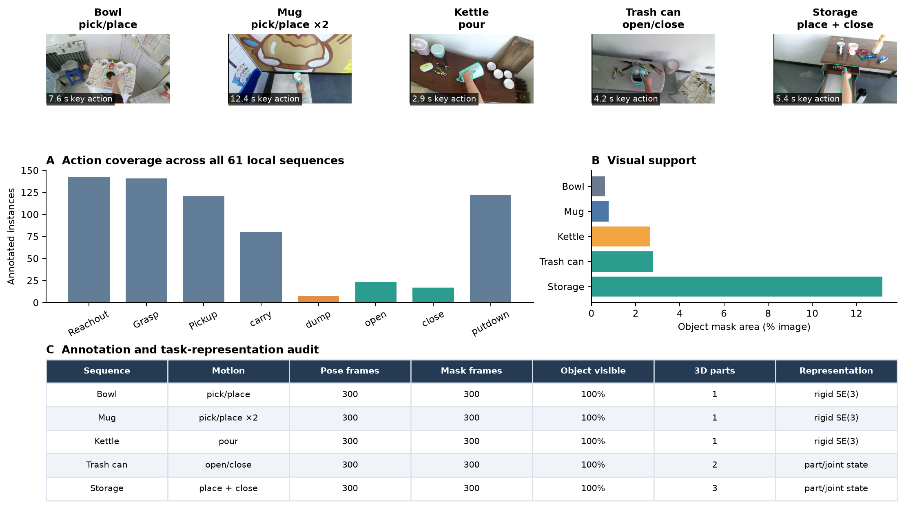
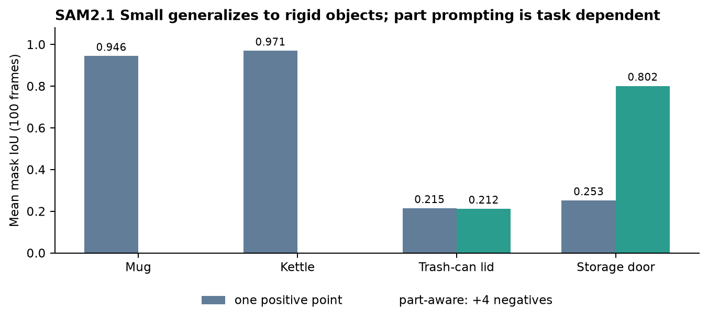

# HOI4D cross-action study

## Question

The main policy result uses one ball-to-bowl sequence. This experiment tests whether
the same input representation is available for other HOI4D objects and motions, and
where the current rigid object-relative skill stops being adequate.

## Protocol

The local HOI4D subset contains 61 twenty-second sequences from seven object
categories. We first audit every action annotation. We then preselect five sequences:
the existing bowl reference plus mug, kettle, trash-can, and storage-furniture clips.
Together they cover repeated pick and place, pouring, and articulated open or close
motions.

For each selected sequence, the benchmark reads all 300 official 3D object-pose
annotations and samples every fifth official motion mask. The masks and poses are
evaluation references; they are not model outputs or policy-success measurements.
Camera-frame path lengths are retained in the JSON record but are not treated as
world-frame motion because the camera is head mounted.

```bash
PYTHONPATH=src .venv/bin/python scripts/benchmark_hoi4d_cross_actions.py
```

## Results



The 61-sequence subset contains 121 `Pickup`, 80 `carry`, 122 `putdown`, 8 `dump`,
23 `open`, and 17 `close` annotations. All 61 sequences have 300 object-pose records;
all 61 have 300 motion masks in either the decoded `mask` or release `shift_mask`
layout.

| Sequence | Motion | Key-action time | Pose / mask frames | Mean object area | 3D parts | Current representation |
|---|---|---:|---:|---:|---:|---|
| Bowl reference | pick/place | 7.59 s | 300 / 300 | 0.62% | 1 | rigid SE(3) |
| Mug | pick/place ×2 | 12.36 s | 300 / 300 | 0.77% | 1 | rigid SE(3) |
| Kettle | pour | 2.95 s | 300 / 300 | 2.64% | 1 | rigid SE(3) plus orientation |
| Trash can | open/close | 4.18 s | 300 / 300 | 2.79% | 2 | part or joint state |
| Storage furniture | place + close | 5.37 s | 300 / 300 | 13.18% | 3 | part or joint state |

The selected object masks are visible in every sampled frame. Mug pose annotation is
effective in 299/300 frames; the other four are effective in 300/300. The trash-can
lid-to-base center distance changes by 35 mm, while the largest storage part-to-part
change is 255 mm. These are direct evidence that treating the whole articulated object
as one rigid transform would erase task-relevant state.

## Decision

The current pipeline can ingest the mug and kettle tasks using the existing rigid
object-relative skill. Kettle adds a meaningful orientation requirement, so policy
synthesis must preserve the demonstrated rotation rather than only the final
translation. Trash-can and storage open or close tasks need a moving-part mask and an
explicit joint or part-relative target before demonstrations can be synthesized.

This experiment establishes input and representation feasibility. It does not claim
cross-action learned-policy success: each new action still needs task-specific
retargeting, synthetic demonstrations, training, and held-out rollouts.

## SAM2 cross-action test

The selected local segmenter was then run on the four new sequences at 5 Hz and a
maximum width of 640 pixels. Each run uses one positive point at the deepest interior
location of the official first-frame mask. The other 99 official masks remain unseen.



| Object or part | Frames | One-point mean IoU | Part-aware mean IoU | Frames ≥ 0.5 IoU |
|---|---:|---:|---:|---:|
| Mug | 100 | **0.946** | — | 100% |
| Kettle | 100 | **0.971** | — | 100% |
| Trash-can lid | 100 | 0.215 | 0.212 | 0% |
| Storage door | 100 | 0.253 | **0.802** | 91% |

For the articulated parts, a second run adds four negative points just outside the
part bounding box. It resolves the storage-door ambiguity but does not improve the
trash-can lid. The trash-can result is therefore a real perception failure, while the
storage result shows that prompt semantics can dominate model choice. The macro mean
for the fixed one-point protocol is 0.596.

The complete measurements and exact sequence IDs are in
[`experiments/hoi4d-cross-action-results.json`](experiments/hoi4d-cross-action-results.json),
[`experiments/hoi4d-cross-action-sam2.json`](experiments/hoi4d-cross-action-sam2.json),
and
[`experiments/hoi4d-articulated-prompt-ablation.json`](experiments/hoi4d-articulated-prompt-ablation.json).
