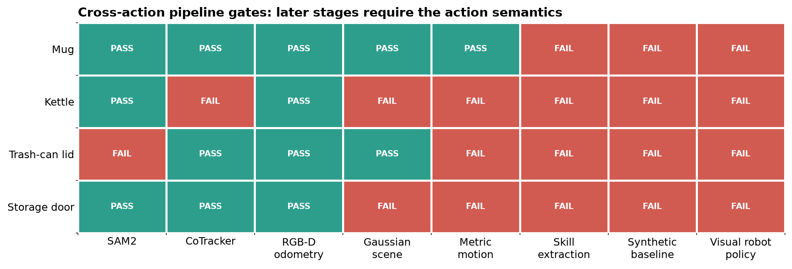

# HOI4D whole-pipeline cross-action evaluation

## Question

Does the implemented small-device pipeline generalize beyond the ball-to-bowl sequence?
This experiment follows four additional HOI4D RGB-D demonstrations through every
implemented stage: segmentation, point tracking, camera odometry, Gaussian scene
fusion, metric object motion, skill extraction, synthetic control, and visual policy
readiness.

The evaluation is hardware-free. A sequence passes end to end only when every stage
passes and the demonstrated action semantics are preserved.

## Protocol

| Stage | Input and measurement | Pass gate |
|---|---|---|
| SAM2.1 Small | Predicted masks against HOI4D motion masks | mean IoU ≥ 0.70 |
| CoTracker3 | 32 points initialized inside the predicted mask | survival ≥ 0.80 and GT-mask containment ≥ 0.80 |
| RGB-D odometry | Estimated camera motion after excluding predicted dynamic masks | reprojection ≤ 5 px and depth residual ≤ 2 cm |
| Gaussian scene | Seven-frame RGB-D fusion, held-out frame 30 | coverage ≥ 0.50 and PSNR ≥ 20 dB |
| Metric motion | Median masked depth transformed by estimated camera poses | p90 relative error ≤ 3 cm |
| Skill extraction | Action-specific, object-relative trajectory | required objects and action state represented |
| Synthetic baseline | Local policy trained on generated demonstrations | success ≥ 80% on a nontrivial task |
| Visual robot policy | Matching simulator task, demonstrations, and checkpoint | closed-loop checkpoint available and evaluated |

Predicted SAM masks are causal inputs to tracking, odometry masking, Gaussian fusion,
and object-motion recovery. HOI4D masks and object centers are used only to score the
outputs. The storage-door row uses the five-point part-aware prompt selected in the
prompt ablation; all other rows use one positive point.

## Results



| Sequence | Mask IoU | Track survival | Odometry px / mm | Gaussian coverage / PSNR | Motion p90 | End to end |
|---|---:|---:|---:|---:|---:|:---:|
| Mug place | 0.946 | 0.999 | 0.72 / 2.8 | 0.746 / 21.48 dB | 2.33 cm | Fail |
| Kettle pour | 0.971 | 0.793 | 0.75 / 3.0 | 0.710 / 16.42 dB | 7.09 cm | Fail |
| Trash-can open/close | 0.215 | 1.000 | 0.76 / 2.5 | 0.734 / 20.97 dB | 8.34 cm | Fail |
| Storage-door close | 0.802 | 0.834 | 0.75 / 3.3 | 0.647 / 15.90 dB | 18.12 cm | Fail |

All four RGB-D odometry runs pass. This isolates the later failures from camera-motion
estimation. The mug also passes Gaussian reconstruction and metric motion, reaching the
skill boundary. Its sequence contains no separately tracked placement target, so the
implemented two-object `Place` extractor cannot form a valid relative skill.

The kettle misses the tracking threshold by 0.007, loses held-out appearance quality,
and exceeds the motion gate. Its pouring action also needs orientation, which the
current position-only skill and controller omit. The trash-can lid has reliable tracks
once initialized, but the mask IoU and metric motion fail. The storage door benefits
from part-aware prompts, then fails held-out rendering and motion recovery. Both
articulated sequences require a part pose and joint coordinate rather than one rigid
object center.

The mug's privileged-state point-robot baseline reports 100/100 success, but its
initial-to-goal XY separation is only 1.5 mm under a 30 mm success tolerance. It is
therefore marked failed as a nontrivial synthetic task. None of the four actions has a
matching robosuite task, task-specific demonstrations, and trained visual checkpoint,
so the final policy gate fails rather than being inferred from the ball-to-bowl model.

## Conclusion

The result is **0/4 strict end-to-end passes**. Small local models are sufficient for
camera odometry and for much of the perception path. The next generalization work is
action representation and task generation: add target discovery for placement,
orientation for pouring, articulated part and joint state, and matching simulator tasks
before training cross-action visual policies.

## Reproduce

The raw HOI4D data and generated arrays remain local and ignored. With the four
processed RGB-D sequences and saved SAM predictions present:

```bash
PYTHONPATH=src .venv/bin/python scripts/evaluate_hoi4d_cross_action_tracking.py
PYTHONPATH=src .venv/bin/python scripts/evaluate_hoi4d_whole_pipeline.py
```

Compact results are in
[`experiments/hoi4d-whole-pipeline-results.json`](experiments/hoi4d-whole-pipeline-results.json).
